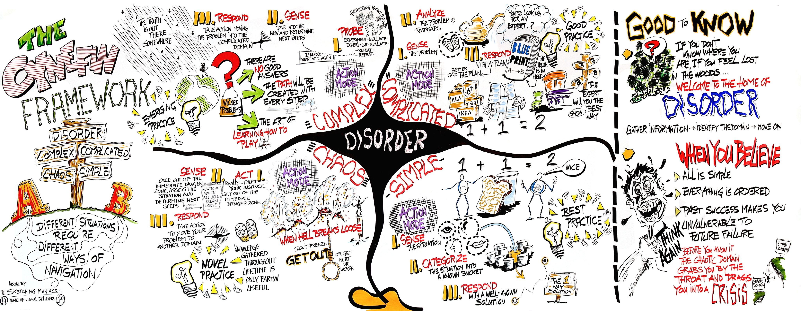
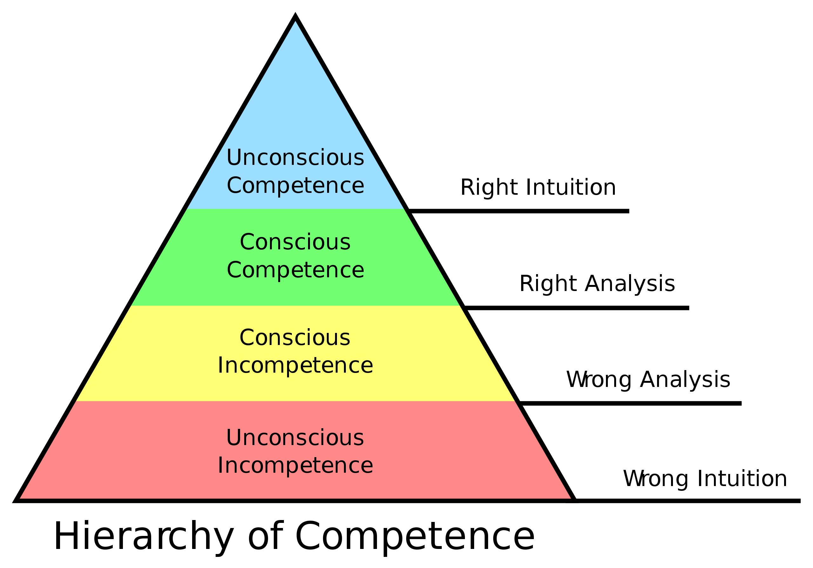
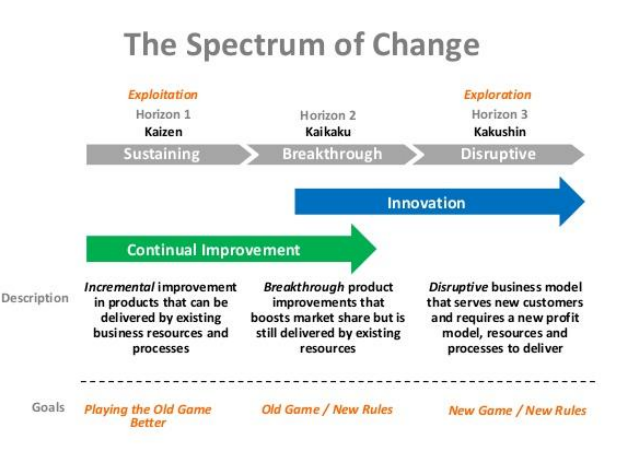
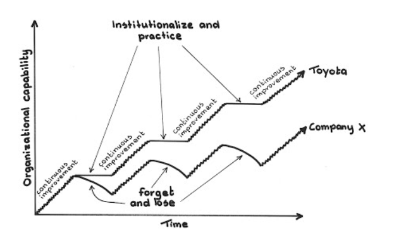
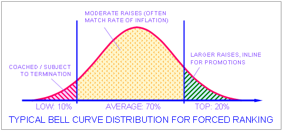
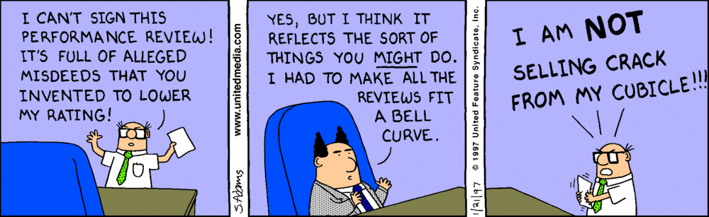
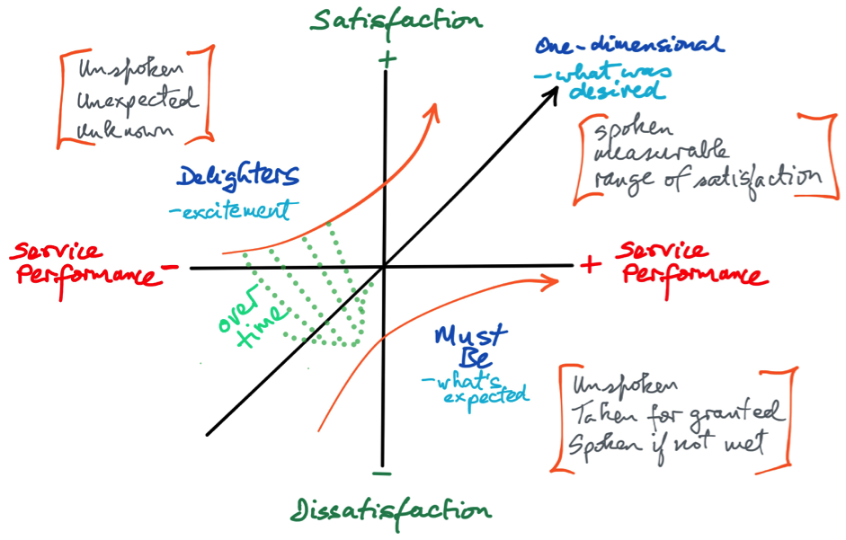

# The BetaCodex Network

The Network helps organizations to transform their management models from command & control (Alpha) to Beta, in order for them to sustain superior competitive success. The BetaCodex Network is the most important platform for achieving transformation and for improving the model.

# Douglas McGregor on Theory X and Theory Y

| Theory X | sphere | Theory Y |
| :- | :-: |  :- |
| Dislike work, find it boring, will avoid if we can | ATTITUDE | Need to work, want to take an interest, we can enjoy it|
| Must be forced or coerced into compliance | DIRECTION | Direct ourselves towards an accepted target | 
| Need to be directed, avoid responsability | RESPONSABILITY | Thrive on responsability |
| Motivated by fear, lack of money, lack of job security | MOTIVATION | Motivated by the desire of self-development and to contribute to the world |
| Little creativity, except when getting around rules | CREATIVITY | Highly creative when given recognition and opportunity|

Reference: https://en.wikipedia.org/wiki/Theory_X_and_Theory_Y

# Cynefin

Cynefin offers five decision-making contexts or "domains"—obvious (known until 2014 as simple), complicated, complex, chaotic, and disorder—that help managers to identify how they perceive situations and make sense of their own and other people's behaviour.The framework draws on research into systems theory, complexity theory, network theory and learning theories.

Reference: https://en.wikipedia.org/wiki/Cynefin_framework

# The Comfort Zone

# Kanban

|Input (future) | Work in Progress (present) | Output (past) |
| :---         |     :---:      |          ---: |
| Do only the right thing | Start here | Make the results tangible |
| Priorization | Visual feedback       | Metrics |
| Expectation alignment | Capacity planning     | Celebration |
| Business value discovery | Tactical coordination | Dissemination |
| Upstream | Small deliverables | |
| Collaborate and conquer | Collaborate and conquer | Collaborate and conquer |

- WIP Limit and Little's Laws: quality improvement, better delivery rate (Lead Time)

#### Metrics

- Lead Time
- Cycle Time
- Throughput
- Cumulative Flow Diagram
- Flow Efficiency

# Four Stages of Competence

|Stages|Description|
|-|-|
|Unconscious incompetence|The individual does not understand or know how to do something and does not necessarily recognize the deficit. They may deny the usefulness of the skill. The individual must recognize their own incompetence, and the value of the new skill, before moving on to the next stage. The length of time an individual spends in this stage depends on the strength of the stimulus to learn.|
|Conscious incompetence|Though the individual does not understand or know how to do something, they recognize the deficit, as well as the value of a new skill in addressing the deficit. The making of mistakes can be integral to the learning process at this stage.|
|Conscious competence|The individual understands or knows how to do something. However, demonstrating the skill or knowledge requires concentration. It may be broken down into steps, and there is heavy conscious involvement in executing the new skill.|
|Unconscious competence|The individual has had so much practice with a skill that it has become "second nature" and can be performed easily. As a result, the skill can be performed while executing another task. The individual may be able to teach it to others, depending upon how and when it was learned.|

Source: https://en.wikipedia.org/wiki/Four_stages_of_competence

# Principles of Software and Quality Architecture

- [Principles of Chaos Engineering](http://principlesofchaos.org/)
- [The Reactive Manifesto](https://www.reactivemanifesto.org/)
- [Modern Testing Principles](https://moderntesting.org/)
- [Shift Left Testing](https://dzone.com/articles/what-is-shift-left-testing)
- [Agile Testing](https://en.wikipedia.org/wiki/Agile_testing)
- [The Twelve Factor App](https://12factor.net/)

# Competence, Ignorance and Risk Management

- Known knowns, known unknowns, unknown unknowns, unknown knowns
- The Five Orders of Ignorance

# Ikigai

Ikigai is a Japanese concept that means "a reason for being." The word "ikigai" is usually used to indicate the source of value in one's life or the things that make one's life worthwhile. The word translated to English roughly means "thing that you live for" or "the reason for which you wake up in the morning." Each individual's ikigai is personal to them and specific to their lives, values and beliefs. It reflects the inner self of an individual and expresses that faithfully, while simultaneously creating a mental state in which the individual feels at ease. Activities that allow one to feel ikigai are never forced on an individual; they are often spontaneous, and always undertaken willingly, giving the individual satisfaction and a sense of meaning to life. (Reference: https://en.wikipedia.org/wiki/Ikigai)

# Kaizen, Kaikaku and Kakushin

Source: https://www.benchmarksixsigma.com/forum/topic/34872-kaizen-kaikaku-kakushin/

## Kaizen

Source: http://leanmagazine.net/agile/kaikaku-mind-the-concept-of-radical-change/

# Roles / Competency Matrix / Ladders

[Team Competency Matrix](https://management30.com/practice/competency-matrix/)

[CircleCI Engineering Competence Matrix](https://docs.google.com/spreadsheets/d/131XZCEb8LoXqy79WWrhCX4sBnGhCM1nAIz4feFZJsEo/edit#gid=0)

[Engineering Roles](https://github.com/meetup/engineering-roles)

[Engineering Ladders](https://github.com/bmoeskau/engineering-ladders)

[Collection](https://www.progression.fyi/)

# Fake Agile

[Understanding Fake Agile (forbes.com, Steve Denning)](https://www.forbes.com/sites/stevedenning/2019/05/23/understanding-fake-agile/amp/)

# Hiring

[Creditas](https://www.lovemondays.com.br/blog-canal-do-rh/creditas-processo-seletivo-sem-vies/)

# Performance Management

[Performance Management Revolution (HBR)](https://hbr.org/2016/10/the-performance-management-revolution)

#### Performance Reviews

>TODO

#### Vitality curve / Stack ranking / Forced ranking / Rank and yank

- Turning promotions into pay cuts
- Encouraging sabotage
- Reduction in productivity (if applied)
- Create insecurity and dissatisfaction when performing employees fear that they’ll be fired
- Unnecessary internal competition that can be destructive to synergy, creativity and innovation
- May lead to biased decision-making and discrimination
- Lazy policy that avoids the hard and necessary work of evaluating each individual objectively, based on his or her merits

Reference: https://en.wikipedia.org/wiki/Vitality_curve

# Ceremonies

## Company

- All Hands
- Town Hall
- Staff meeting
- Mission Oriented
- Ask me anything
- Celebration of Failure

## Invidual

- One on One

## Teams

### Retrospective

The prime directive: 
> "Regardless of what we discover, we understand and truly believe that everyone did the best job they could, given what they knew at the time, their skills and abilities, the resources available, and the situation at hand." - Norm Kerth, Project Retrospectives: A Handbook for Team Review

Methodology:
- Small starfish
- Starfish
- Timeline
- Feelings and paths

### Futurespective

Methodology:
- Path to Nirvana
- Hero's Journey
- Plan of Action
- Telos thinking

# MVP, MMP

#### The Minimum Viable Product

>The minimum viable product (MVP), as defined by Eric Ries, is a learning vehicle. It allows you to test an idea by exposing an early version of your product to the target users and customers, to collect the relevant data, and to learn form it. For instance, to test the viability of using ads as the major revenue source, you could release an early product increment with fake ads, and measure if and how often people click on the them.

#### The Minimal Marketable Product

> The minimal marketable product (MMP) is a different type of product. It is based on the idea that less is more. The MMP describes the product withthe smallest possible feature setthat addresses the user needs, creates the desired user experience, and can hence be marketed and sold successfully. The MMP is a tool to reduce time-to-market: It can be launched more quickly than a fat, feature-rich one.

Source: https://dzone.com/articles/minimum-viable-product-and

#### Prioritizing Customer Satisfaction and Delight: Kano Model

